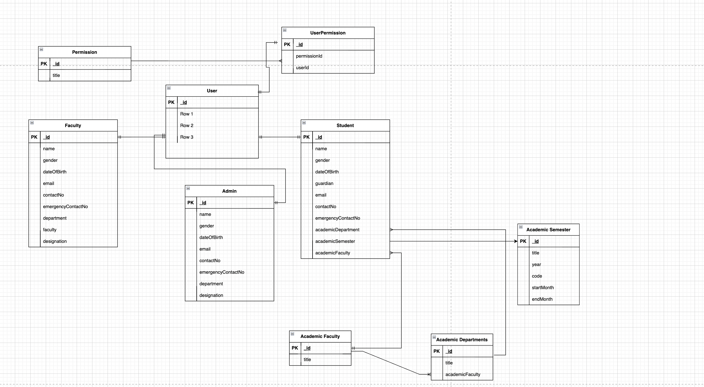

we have to make three types of id.

- 1. student id -> `generateStudentId()`->📀 User Collection(id,role,password)-> `🔋student collection`
- 2. faculty id ->
- 3. admin id

**switch branch**

`git checkout UM-3`

[visit this doc](https://mongoosejs.com/docs/typescript.html)

**Create:**

make `interface` -> `sechema` --> `model`-->`service`-->`controller`-->`route`

  users.interface.ts
  users.model.ts
  user.service.ts
  user.utils.ts
  user.controller.ts

